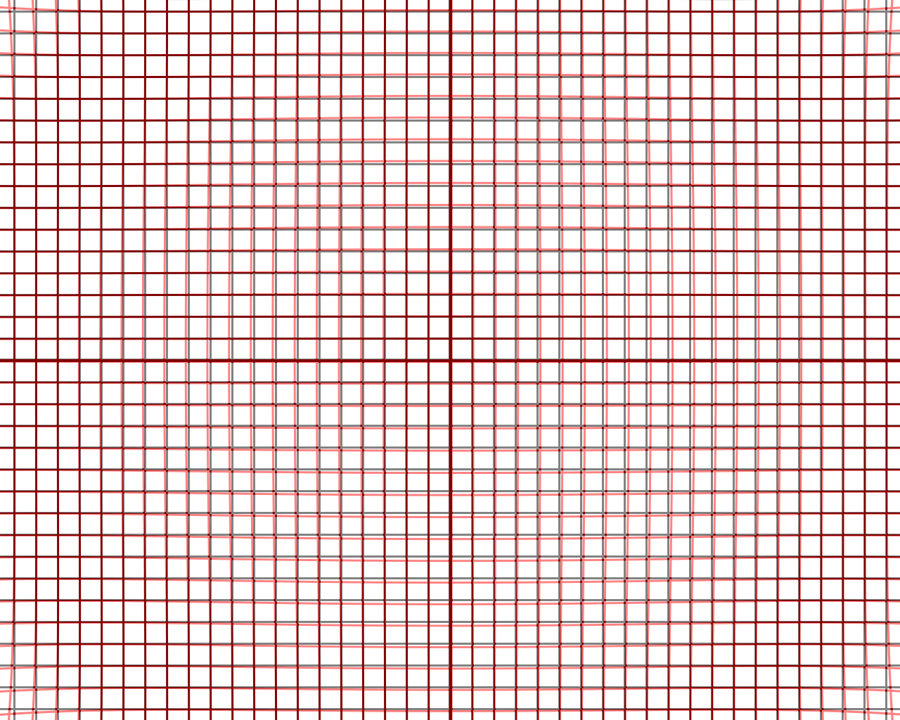

# Camera_Caliberation

This project is a simple template for camera caliberation in C++.

[](https://github.com/QuintinUmi)


<br />


### Files Structure Description
eg:

```
camera_caliberation_pkg
        ├── CMakeLists.txt
        ├── config
        │   ├── caliberation_param.yaml
        │   └── setup.yaml
        ├── include
        │   ├── camera_caliberation_chessboard.h
        │   ├── param_code.h
        │   └── undistortion.h
        ├── launch
        │   ├── camera_caliberation.launch
        │   ├── opencv_undistortion_time_cost_test.launch
        │   ├── show_distorted_grid_pattern.launch
        │   └── undistortion.launch
        ├── lib
        │   ├── camera_caliberation_chessboard.cpp
        │   └── undistortion.cpp
        ├── package.xml
        └── src
            ├── camera_caliberation.cpp
            ├── show_distorted_grid_pattern.cpp
            └── undistortion_sample.cpp
```

<br />

## Node File Description

###This project includes 1 package (camera_caliberation_pkg) and 3 nodes (camera_caliberation; show_distorted_grid_pattern; undistortion_sample).

Node "camera_caliberation" is to do caliberation for camera.
Node "show_distorted_grid_pattern" can show the comparison between distorted and undistorted grid pattern for reference.
Node "undistortion_sample" is a sample to show the image after undistortion proccess.

To use these nodes, please use launch file for transmitting server parameters.

### Example for Node "show_distorted_grid_pattern"

<br />
<p align="center">
        <a href="https://github.com/QuintinUmi/camera_caliberation/">
            
                 
        </a>
</p>

## Launch File Description

Please use launch command to run the nodes. Before use it, please edit the yaml file in ./config folder.

<br />

Contributor: QuintinUmi


