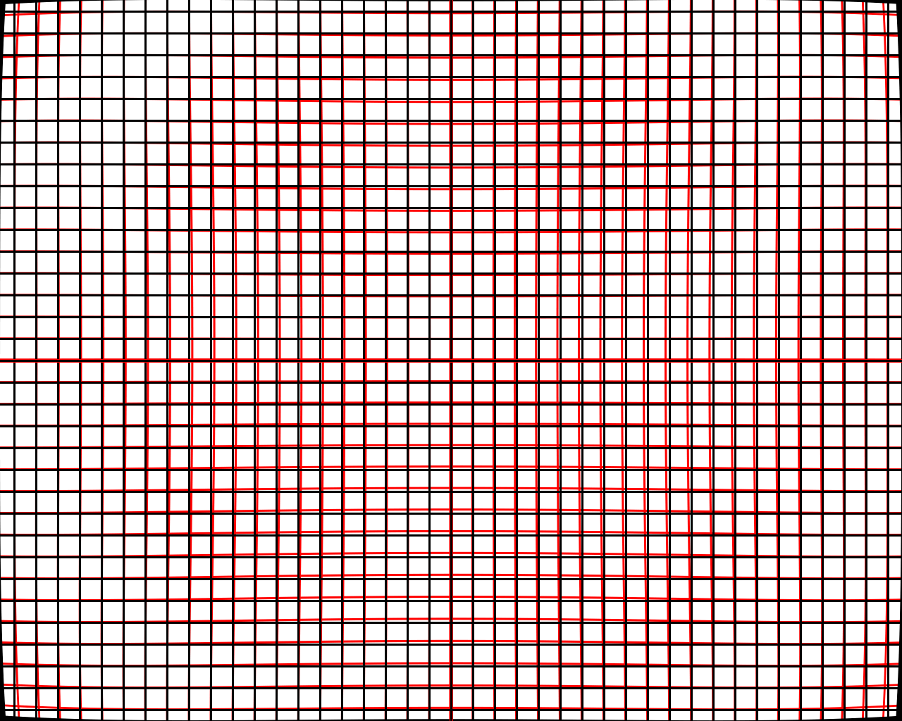

# Camera_Caliberation

This project is a simple template for camera caliberation in C++.

[](https://github.com/QuintinUmi)


<br />


### Files Structure Description
eg:

```
camera_caliberation_pkg
        ├── CMakeLists.txt
        ├── config
        │   ├── caliberation_param.yaml
        │   └── setup.yaml
        ├── include
        │   ├── camera_caliberation_chessboard.h
        │   ├── param_code.h
        │   └── undistortion.h
        ├── launch
        │   ├── camera_caliberation.launch
        │   ├── opencv_undistortion_time_cost_test.launch
        │   ├── show_distorted_grid_pattern.launch
        │   └── undistortion.launch
        ├── lib
        │   ├── camera_caliberation_chessboard.cpp
        │   └── undistortion.cpp
        ├── package.xml
        └── src
            ├── camera_caliberation.cpp
            ├── opencv_undistortion_time_cost_test.cpp
            ├── show_distorted_grid_pattern.cpp
            └── undistortion_sample.cpp
```


<br />
<p align="center">
  <a href="https://github.com/QuintinUmi/camera_caliberation/">
    
  </a>

  <h3 align="center">"完美的"README模板</h3>
  <p align="center">
    一个"完美的"README模板去快速开始你的项目！
    <br />
    <a href="https://github.com/shaojintian/Best_README_template"><strong>探索本项目的文档 »</strong></a>
    <br />
    <br />
    <a href="https://github.com/shaojintian/Best_README_template">查看Demo</a>
    ·
    <a href="https://github.com/shaojintian/Best_README_template/issues">报告Bug</a>
    ·
    <a href="https://github.com/shaojintian/Best_README_template/issues">提出新特性</a>
  </p>

</p>
[issues-url]: https://img.shields.io/github/issues/shaojintian/Best_README_template.svg
[license-shield]: https://img.shields.io/github/license/shaojintian/Best_README_template.svg?style=flat-square
[license-url]: https://github.com/shaojintian/Best_README_template/blob/master/LICENSE.txt
[linkedin-shield]: https://img.shields.io/badge/-LinkedIn-black.svg?style=flat-square&logo=linkedin&colorB=555
[linkedin-url]: https://linkedin.com/in/shaojintian
